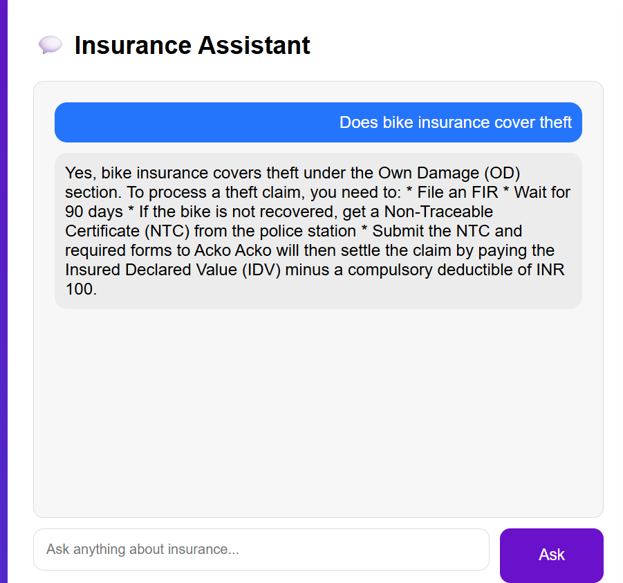
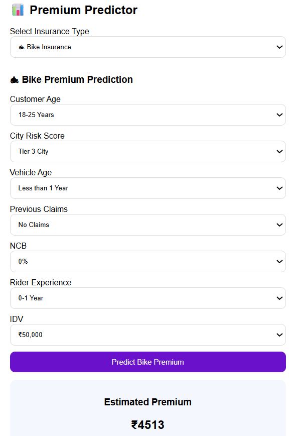
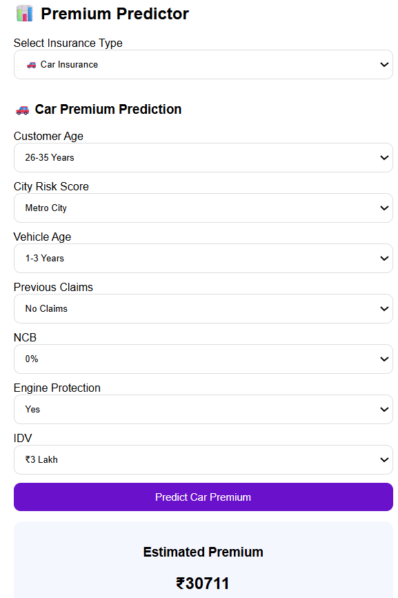
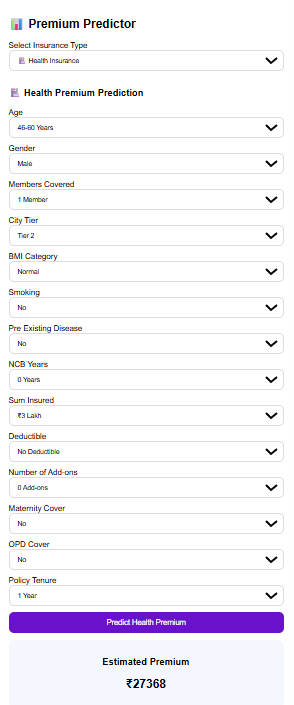
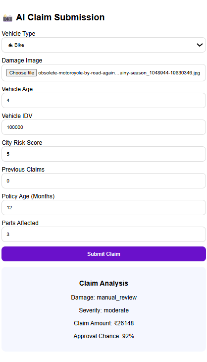
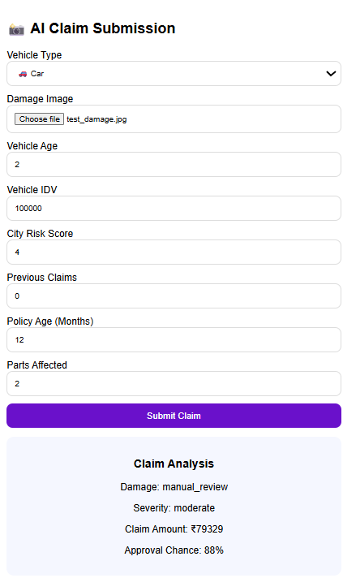
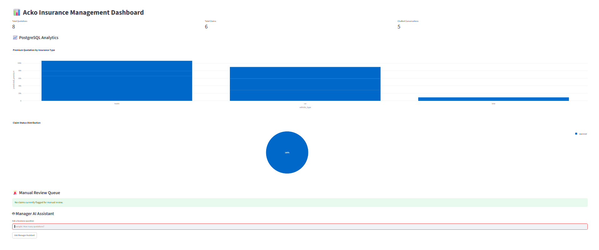
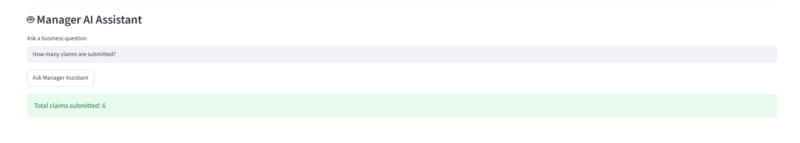
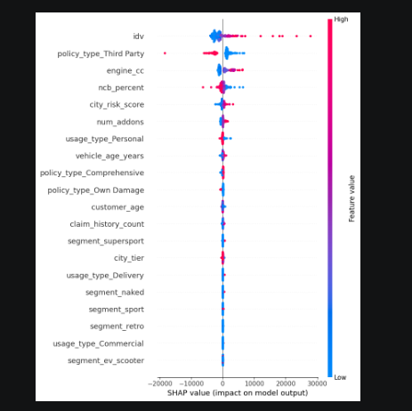

# 🚀 Acko Insurance AI & Analytics Platform

## Problem Statement

Insurance processes are often slow, manual, and fragmented. Customers need to read lengthy policy documents to understand coverage, wait for agents to receive premium quotations, and go through time-consuming claim submission and approval processes. At the same time, insurance managers rely on technical teams to generate reports and answer business questions from operational data.

The objective of this project is to build an end-to-end AI-powered insurance platform that automates these processes using Machine Learning, Generative AI, Computer Vision, and Cloud Technologies.

The platform enables:

* Customers to ask insurance-related questions and receive instant answers from policy documents using a RAG (Retrieval-Augmented Generation) chatbot.
* Customers to obtain real-time insurance premium quotations for Bike, Car, and Health insurance policies.
* Customers to submit claims by uploading damage images and claim details, with AI predicting claim amount and approval probability.
* Managers to monitor business performance through a live analytics dashboard.
* Managers to ask business questions in natural language and receive insights directly from the database without writing SQL queries.

The solution integrates LangChain, ChromaDB, Google Gemini, Machine Learning models, PostgreSQL, AWS S3, AWS RDS, AWS EC2, Flask, and Streamlit to create a scalable AI-driven insurance platform.

The platform simulates real-world insurance workflows including quote generation, claim processing, business analytics, and intelligent customer support.

---

## Business Impact

* Faster customer support through AI-powered policy assistance.
* Instant premium quotations without agent intervention.
* Automated claim assessment and risk evaluation.
* Reduced operational workload for insurance teams.
* Real-time analytics and decision-making support for managers.
* Cloud-based scalable architecture suitable for enterprise deployment.

## Project Objectives

* Build a RAG-based Insurance Policy Chatbot.
* Predict insurance premiums using Machine Learning models.
* Automate insurance claim assessment using AI and Computer Vision.
* Develop a real-time analytics dashboard for managers.
* Enable natural language interaction with business data using AI.
* Deploy the complete solution on AWS Cloud infrastructure.

## Project Architecture

The Acko Insurance AI Platform consists of five integrated modules connected through a centralized PostgreSQL database and deployed on AWS Cloud.

## Architecture Flow

* Customer/User → Flask Web Application

* Flask Application → RAG Chatbot (LangChain + ChromaDB + Hugginf Face Embeddings + Groq API + Llama)

* Flask Application → Premium Prediction Models (Scikit-learn)

* Flask Application → Claim Assessment Engine (Gemini Vision + ML Models)

* Flask Application → PostgreSQL Database (AWS RDS)

* Claim Images & Documents → AWS S3

* Manager Dashboard → Streamlit + PostgreSQL

* Manager AI Assistant → Natural Language Query → PostgreSQL → Response

### Cloud Components

* AWS EC2 hosts the Flask application and Streamlit dashboard.
* AWS RDS PostgreSQL stores quotations, claims, chatbot logs, and analytics data.
* AWS S3 stores uploaded claim images and claim documents.
* ChromaDB stores vector embeddings generated from insurance policy documents.


### AI Components

- LangChain powers the Retrieval-Augmented Generation (RAG) workflow.
- Hugging Face Sentence Transformers generate vector embeddings.
- ChromaDB stores document embeddings and performs semantic similarity search.
- Groq API provides access to the Llama model for generating context-aware responses.
- Google Gemini Vision analyzes uploaded vehicle damage images.
- Scikit-learn models predict insurance premiums, claim amounts, and claim approval probabilities.
- SHAP provides explainability for premium prediction models.

### Data Flow

* User submits a query, quotation request, or claim.
* Flask routes the request to the appropriate AI module.
* Predictions and responses are generated.
* Results are stored in PostgreSQL.
* Claim files are uploaded to AWS S3.
* Dashboard and Manager Assistant retrieve live data from PostgreSQL.
* Managers monitor KPIs and interact with data using natural language queries.

## Key Features

### 1. AI Policy Chatbot (RAG)

An intelligent insurance assistant capable of answering customer questions using real Acko policy documents. The chatbot retrieves relevant policy content from a vector database and generates context-aware responses using Google Gemini.

Features:

* Policy Question Answering
* PDF-based Knowledge Retrieval
* ChromaDB Vector Search
* LangChain RAG Pipeline
* Conversation Logging in PostgreSQL

### 2. Insurance Premium Prediction

Machine Learning models generate real-time insurance premium estimates for Bike, Car, and Health Insurance policies based on customer and policy attributes.

Features:

* Bike Insurance Premium Prediction
* Car Insurance Premium Prediction
* Health Insurance Premium Prediction
* Real-time Premium Calculation
* SHAP-based Model Explainability
* Quotation Storage in PostgreSQL

### 3. AI Claims Assessment Engine

Customers can upload damage images and claim details to receive an estimated claim amount and approval probability.

Features:

* Damage Image Analysis using Gemini Vision
* Claim Amount Prediction
* Claim Approval Prediction
* Bike Claim Models
* Car Claim Models
* AWS S3 File Storage
* PostgreSQL Claim Tracking

### 4. Management Analytics Dashboard

A real-time dashboard providing insurance business insights, KPIs, and operational analytics.

Features:

* Total Claims Monitoring
* Quotation Analytics
* Claim Approval Analysis
* City-wise Distribution Reports
* Trend Analysis
* Interactive Charts and KPIs

### 5. Manager AI Assistant

A natural language business intelligence assistant that allows managers to query operational data without writing SQL.

Features:

* Natural Language Querying
* Live PostgreSQL Data Access
* Claims Analytics
* Quotation Analytics
* Chatbot Usage Analytics
* Real-time Business Insights

## ## Tech Stack

| Category               | Technologies Used     |
| ---------------------- | --------------------- |
| Programming Language   | Python                |
| Backend Framework      | Flask                 |
| Dashboard Framework    | Streamlit             |
| Machine Learning       | Scikit-learn          |
| Data Processing        | Pandas, NumPy         |
| Generative AI          | Groq API, Llama-3.3-70B-Versatile, Google Gemini Vision     |
| Computer Vision        | Gemini Vision API     |
| RAG Framework          | LangChain             |
| Workflow Orchestration | LangGraph             |
| Vector Database        | ChromaDB              |
| Embedding Model        | Sentence Transformers |
| Database               | PostgreSQL            |
| ORM                    | SQLAlchemy            |
| Cloud Storage          | AWS S3                |
| Cloud Database         | AWS RDS               |
| Cloud Hosting          | AWS EC2               |
| Explainable AI         | SHAP                  |
| Data Visualization     | Plotly, Altair        |
| Version Control        | Git, GitHub           |

### Core Technologies

#### Artificial Intelligence & Machine Learning

* LangChain
* LangGraph
* Google Gemini
* Gemini Vision
* Scikit-learn
* SHAP

#### Data Engineering

* Pandas
* NumPy
* PostgreSQL
* SQLAlchemy

#### Cloud Services

* AWS EC2
* AWS RDS
* AWS S3

#### Analytics & Visualization

* Streamlit
* Plotly
* Altair

#### Deployment & Version Control

* Git
* GitHub
* Docker

## Project Outcomes

The Acko Insurance AI Platform successfully integrates Machine Learning, Generative AI, Computer Vision, Cloud Computing, and Business Analytics into a single end-to-end insurance solution.

### Key Achievements

* Developed a RAG-based AI chatbot capable of answering insurance-related questions using real policy documents.
* Built premium prediction models for Bike, Car, and Health Insurance.
* Implemented AI-powered claim assessment with claim amount prediction and approval probability estimation.
* Integrated Google Gemini Vision for damage image analysis.
* Deployed the complete application on AWS EC2.
* Configured AWS RDS PostgreSQL for storing quotations, claims, and chatbot logs.
* Implemented AWS S3 integration for claim image storage.
* Built a real-time Streamlit dashboard for insurance analytics.
* Developed a Manager AI Assistant capable of answering business questions using natural language.
* Added SHAP explainability for machine learning model interpretation.

### Performance Summary

* Premium Prediction Models evaluated using R² Score, RMSE, and MAE.
* Claim Approval Models achieved approximately 91% accuracy.
* RAG Chatbot successfully retrieves and answers questions from policy documents using ChromaDB and Gemini.
* Manager AI Assistant retrieves live business insights directly from PostgreSQL.

### Deployment Status

* Flask Application: Successfully deployed
* Streamlit Dashboard: Successfully deployed
* AWS EC2: Configured and operational
* AWS RDS PostgreSQL: Connected and operational
* AWS S3: Integrated and operational
* ChromaDB: Configured for policy document retrieval

## Screenshots

### Home Page


### AI Policy Chatbot



### Bike Insurance Premium Prediction



### Car Insurance Premium Prediction



### Health Insurance Premium Prediction



### Bike Claim Assessment



### Car Claim Assessment



### Analytics Dashboard



### Manager AI Assistant



### SHAP Explainability



### AWS Architecture


## Deployment

Flask Application:
http://13.203.207.55:5000

Analytics Dashboard:
http://13.203.207.55:8501

Cloud Services Used:
- AWS EC2
- AWS RDS PostgreSQL
- AWS S3

## Project Structure
```
Acko-AI-Platform/
│
├── app/
├── rag_chatbot/
├── ml_model/
├── claim_ai/
├── dashboard/
├── manager_ai/
├── database/
├── data/
├── screenshots/
├── MODEL_EVALUATION.md
├── DEPLOYMENT.md
├── Dockerfile
└── README.md
```

## Future Enhancements

- Multi-language chatbot support
- Real-time fraud detection
- Automated claim document verification
- Policy recommendation engine
- CI/CD pipeline deployment
- Kubernetes-based scaling
- Mobile application integration

## Author

Baby Prabha A

Data Science & Generative AI Enthusiast

GitHub:
https://github.com/Prabha-1909

Project:
Acko Insurance AI Platform

